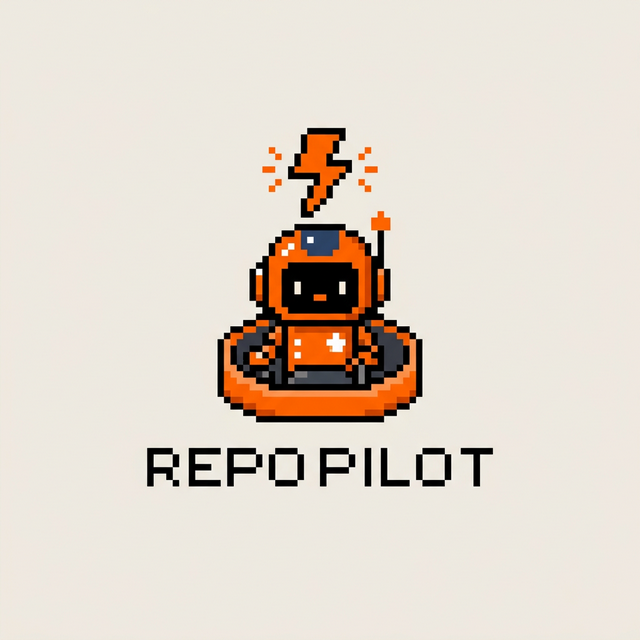
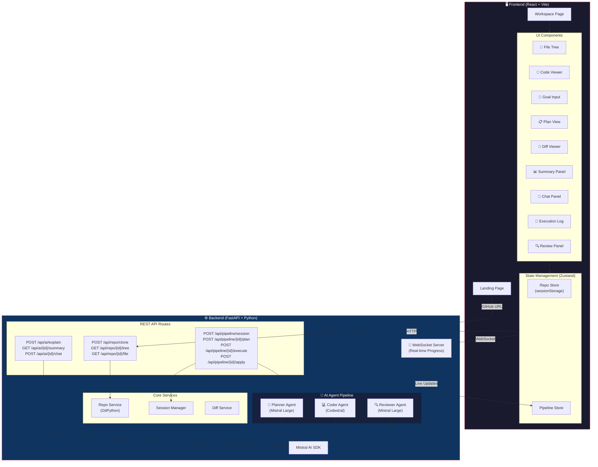
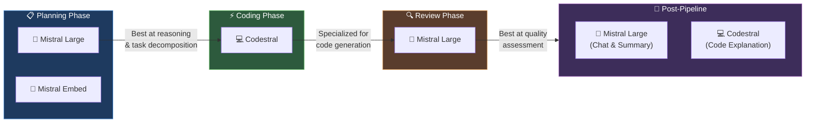

<p align="center">
  
</p>

<h1 align="center">RepoPilot 🚀</h1>

<p align="center">
  <strong>AI-Powered Autonomous Developer — Analyze, Plan, Code, Review & Ship.</strong>
</p>

<p align="center">
  
  
  
  
</p>

<p align="center">
  Built for the <strong>Mistral AI Hackathon</strong> 🏆
</p>

---

## 🎯 What is RepoPilot?

RepoPilot is an **AI-powered autonomous developer** that goes beyond code generation. Give it any GitHub repository and a natural-language goal, and it will:

1. **📂 Analyze** — Clone and deeply understand the codebase structure, languages, and architecture
2. **📋 Plan** — Generate a structured, multi-task development plan using AI
3. **⚡ Code** — Produce precise, multi-file code changes for each task
4. **🔍 Review** — Self-review all generated changes for quality, correctness, and goal alignment
5. **✅ Apply** — Commit approved changes back to the repository
6. **💬 Chat** — Discuss the code, ask questions, and request follow-up improvements

> **Think of it as an AI developer that doesn't just write code — it thinks, plans, executes, and reviews like a senior engineer.**

---

## 🏗️ Architecture Overview



---

## 🔄 Multi-Agent Pipeline Flow

The core innovation of RepoPilot is its **multi-agent pipeline** — three specialized AI agents working in sequence, each using the optimal Mistral model for its task:

```mermaid
sequenceDiagram
    actor User
    participant FE as 🖥️ Frontend
    participant API as ⚙️ FastAPI
    participant WS as 🔌 WebSocket
    participant P as 🧠 Planner<br/>(Mistral Large)
    participant C as 💻 Coder<br/>(Codestral)
    participant R as 🔍 Reviewer<br/>(Mistral Large)

    User->>FE: Enter GitHub URL
    FE->>API: POST /repo/clone
    API-->>FE: Repo structure + file tree

    User->>FE: Describe goal in natural language
    FE->>API: POST /pipeline/session
    API-->>FE: Session ID
    FE->>WS: Connect (session_id)

    rect rgb(30, 60, 90)
        Note over API,P: 📋 PLANNING PHASE
        FE->>API: POST /pipeline/{id}/plan
        API->>P: Analyze repo structure + goal
        P->>WS: 📡 analyzing... reading_files...
        WS-->>FE: Real-time progress updates
        P->>WS: 📡 building_context... ai_thinking...
        P-->>API: Structured Task Plan
        API-->>FE: Task plan (N tasks)
    end

    User->>FE: Click "Execute Plan"

    rect rgb(40, 80, 50)
        Note over API,C: ⚡ CODING PHASE
        loop For each task in plan
            API->>C: Generate code for task
            C->>WS: 📡 task_start → coding → task_complete
            WS-->>FE: Live streaming updates
            C-->>API: File changes + diffs
        end
    end

    rect rgb(80, 50, 30)
        Note over API,R: 🔍 REVIEW PHASE
        API->>R: Review all generated changes
        R->>WS: 📡 review_start
        R-->>API: Review report + score
        API-->>FE: Results + review
    end

    User->>FE: Click "Apply All Changes"
    FE->>API: POST /pipeline/{id}/apply
    API-->>FE: Changes committed ✅
```



---

## 🧠 Mistral AI Model Strategy

RepoPilot deliberately selects the **optimal Mistral model** for each task:



| Phase | Model | Why This Model? |
|-------|-------|-----------------|
| **Analysis & Planning** | Mistral Large | Superior reasoning for understanding complex codebases and creating structured task breakdowns |
| **Context Building** | Mistral Embed | Efficient embeddings for mapping repository structure |
| **Code Generation** | Codestral | Purpose-built for code — generates precise, multi-file edits with correct syntax |
| **Code Review** | Mistral Large | Strong analytical reasoning to catch bugs, security issues, and quality problems |
| **AI Chat** | Mistral Large | Conversational ability with deep code comprehension |
| **Code Explanation** | Codestral | Specialized understanding of code patterns and architecture |

---

## ✨ Key Features

### 🔄 Real-Time Streaming
Watch the AI work in real-time via WebSocket. See which task is being coded, which files are changing, and track progress live — no waiting for a black-box to finish.

### 💬 AI Chat with Codebase Context
After the pipeline runs, chat with Mistral Large about the generated changes. Ask questions, request explanations, or suggest improvements — all with full context of the codebase and changes.

### 📊 AI Summary Report
Generate a comprehensive report that explains what was built, why, and how. Perfect for documentation and stakeholder updates.

### 🔍 Code Explanation (Codestral)
Click "Explain" on any file to get an AI-powered breakdown of its structure, purpose, and key functions. Results are cached to save tokens.

### 🎨 Premium UI with Resizable Panels
- Drag-to-resize file explorer and right panel
- Glassmorphism design with smooth animations
- Pulsing Mistral model logos during AI operations
- Tab state persistence — switch tabs without losing data

### 💾 Smart State Management
- Explanation caching prevents redundant API calls
- Session storage persists repo state across refreshes
- Zustand stores for predictable state updates

---

## 🛠️ Tech Stack

| Layer | Technology | Purpose |
|-------|-----------|---------|
| **Frontend** | React 18 + TypeScript | UI Framework |
| **Build** | Vite 5 | Fast development & bundling |
| **State** | Zustand + sessionStorage | Global state management with persistence |
| **Icons** | Lucide React + Mistral Brand Icons | UI iconography |
| **Styling** | Custom CSS + Glassmorphism | Premium dark theme |
| **Backend** | FastAPI (Python 3.11+) | High-performance async API |
| **AI SDK** | Mistral AI Python SDK | Model integration |
| **Git** | GitPython | Repository operations |
| **Real-time** | WebSocket (FastAPI) | Live progress streaming |

---

## 🚀 Getting Started

### Prerequisites
- **Node.js** 18+
- **Python** 3.11+
- **Mistral AI API Key** — Get one at [console.mistral.ai](https://console.mistral.ai)

### 1. Clone the Repository

```bash
git clone https://github.com/phanibhushan1911/RepoPilot.git
cd RepoPilot
```

### 2. Backend Setup

```bash
cd backend
python -m venv venv
source venv/bin/activate  # On Windows: venv\Scripts\activate
pip install -r requirements.txt

# Configure environment
cp .env.example .env
# Edit .env and add your MISTRAL_API_KEY

# Start the server
uvicorn app.main:app --reload --port 8000
```

### 3. Frontend Setup

```bash
cd frontend
npm install
npm run dev
```

### 4. Open the App

Navigate to **http://localhost:5173** and start building! 🎉

---

## 📁 Project Structure

```
RepoPilot/
├── frontend/                          # React + Vite + TypeScript
│   ├── public/                        # Static assets & logos
│   ├── src/
│   │   ├── components/
│   │   │   ├── pipeline/              # AI pipeline UI
│   │   │   │   ├── ChatPanel.tsx      # 💬 AI chat interface
│   │   │   │   ├── DiffViewer.tsx     # 🔀 Code diff display
│   │   │   │   ├── ExecutionLog.tsx   # 📝 Real-time logs
│   │   │   │   ├── GoalInput.tsx      # 🎯 Goal entry + progress
│   │   │   │   ├── PlanView.tsx       # 📋 Task plan display
│   │   │   │   └── SummaryPanel.tsx   # 📊 AI summary report
│   │   │   ├── repo/
│   │   │   │   ├── CodeViewer.tsx     # 📄 Code viewer + AI explain
│   │   │   │   └── FileTree.tsx       # 📁 Interactive file tree
│   │   │   ├── review/
│   │   │   │   └── ReviewPanel.tsx    # 🔍 AI review display
│   │   │   ├── MistralIcon.tsx        # 🎨 Mistral model icons
│   │   │   └── ResizeHandle.tsx       # ↔️ Drag-to-resize panels
│   │   ├── pages/
│   │   │   ├── LandingPage.tsx        # 🏠 Home page
│   │   │   └── WorkspacePage.tsx      # 🖥️ Main workspace
│   │   ├── services/
│   │   │   ├── api.ts                 # 🌐 REST API client
│   │   │   └── websocket.ts          # 🔌 WebSocket client
│   │   ├── stores/
│   │   │   ├── pipelineStore.ts       # Pipeline state + WS handlers
│   │   │   └── repoStore.ts          # Repo state (persisted)
│   │   └── types/index.ts            # TypeScript interfaces
│   └── ...
│
├── backend/                           # Python FastAPI
│   ├── app/
│   │   ├── api/routes/
│   │   │   ├── repo.py               # 📂 Repo clone & file endpoints
│   │   │   ├── pipeline.py           # 🔄 Pipeline orchestration
│   │   │   ├── ai.py                 # 🤖 AI chat, explain, summary
│   │   │   └── files.py              # 📄 File read endpoints
│   │   ├── services/
│   │   │   ├── ai/
│   │   │   │   ├── planner.py        # 🧠 Planner Agent
│   │   │   │   ├── coder.py          # 💻 Coder Agent
│   │   │   │   ├── reviewer.py       # 🔍 Reviewer Agent
│   │   │   │   ├── prompts.py        # 📝 System prompts
│   │   │   │   └── mistral_client.py # 🔑 Mistral SDK wrapper
│   │   │   ├── repo_service.py       # Git operations
│   │   │   ├── diff_service.py       # Diff generation
│   │   │   └── session_manager.py    # Session lifecycle
│   │   └── models/                   # Pydantic schemas
│   └── requirements.txt
│
└── README.md
```

---

## 🎥 How It Works

### Step 1: Import a Repository
Paste any public GitHub URL. RepoPilot clones it and builds a complete understanding of the project structure, languages, and file relationships.

### Step 2: Describe Your Goal
Write what you want in plain English:
> *"Add user authentication with JWT tokens, including login and registration endpoints"*

### Step 3: Watch the AI Work
The multi-agent pipeline kicks in:
- **Planner** (Mistral Large) breaks down the goal into actionable tasks
- **Coder** (Codestral) generates code changes for each task
- **Reviewer** (Mistral Large) scores and validates everything

All streamed live to your screen via WebSocket. ⚡

### Step 4: Review & Apply
Inspect the diff, read the AI review, generate a summary report, or chat with the AI about the changes. When satisfied, click **Apply** to commit everything.

---

## 🏆 Built for the Mistral AI Hackathon

RepoPilot demonstrates:
- **Multi-model orchestration** — Right model for each task (Large for reasoning, Codestral for code)
- **Agentic pipeline** — Autonomous plan → code → review workflow
- **Real-time streaming** — WebSocket-powered live progress
- **Full-stack integration** — Production-quality React + FastAPI application
- **Smart UX** — Caching, persistence, resizable panels, and premium design

---

## 📝 License

MIT — Built with ❤️ for the Mistral AI Hackathon by [Phani Bhushan](https://github.com/phanibhushan1911)
